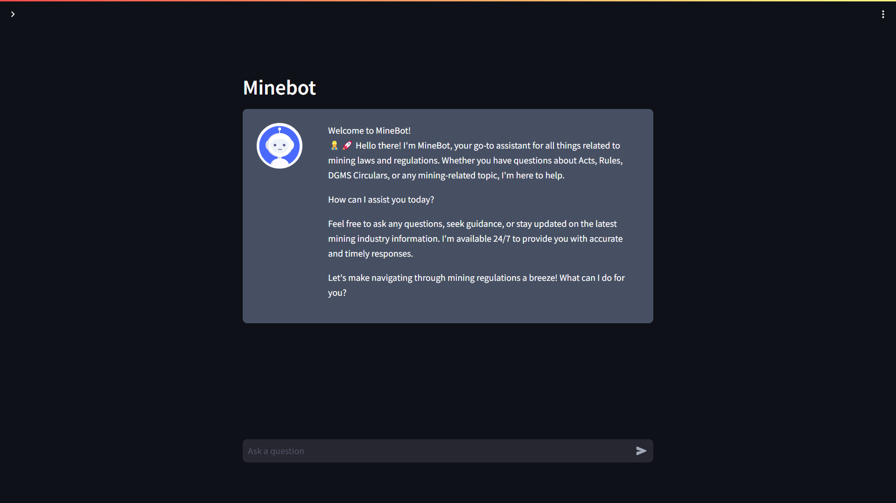

---

# MineBot

MineBot is an intelligent chatbot designed to provide information and assistance regarding mining laws and regulations in India. It leverages advanced natural language processing (NLP) techniques and external knowledge bases to offer accurate and timely responses to user queries.

## Features

- **Mining Law Expertise**: MineBot is equipped with knowledge about various mining acts, regulations, circulars, and notifications relevant to the mining industry in India.

- **Natural Language Understanding**: Users can interact with MineBot using natural language queries, making it easy to seek information and guidance on mining-related topics.

- **External Knowledge Sources**: MineBot utilizes external knowledge bases, including Wikipedia and Google Search, to supplement its responses and provide comprehensive information.

- **ReAct Framework**: MineBot employs the ReAct framework, which facilitates reasoning and intelligent action selection based on user prompts and available tools.

- **Dockerized Deployment**: The MineBot prototype is dockerized, enabling seamless deployment on various platforms and environments.

## Demo

To interact with MineBot, simply input your questions related to mining laws and regulations in the chat interface.



## Getting Started

To run MineBot locally, follow these steps:

1. Clone the repository to your local machine.
2. Install the required dependencies listed in the `requirements.txt` file.
3. Activate the Python virtual environment (if applicable).
4. Make sure to set up the required environment variables in a `.env` file.
5. Run the Streamlit app using the command `streamlit run app.py`.
6. Access MineBot through your web browser at `localhost:8501`.

## Environment Variables

Create a `.env` file in your project and add your own api keys for these variables.

```
HUGGINGFACEHUB_API_TOKEN = 
OPENAI_API_KEY = 
SERPAPI_API_KEY = 
```

## Troubleshooting

### SWIG Error when installing faiss-cpu

If you encounter an error related to SWIG when installing the `faiss-cpu` package, you can try the following steps to resolve the issue:

Install the `swig` package using the following command:

```bash
sudo apt-get update
sudo apt-get install swig
```

For windows, you can download the swig executable from the [official website](http://www.swig.org/download.html).

## Deployment

MineBot can also be deployed using Docker. Simply build the Docker image using the provided Dockerfile and run the container on your preferred platform.

## Contributors

- [Siranjeevi K](https://github.com/SiranjeeviK)

## License

This project is licensed under the [LICENSE](LICENSE). 
Please contact the author, Siranjeevi K, for permission to use this project in commercial applications. 
For non-commercial and educational purposes, you are free to use and modify the project, provided that proper credit is given to the author.

---
